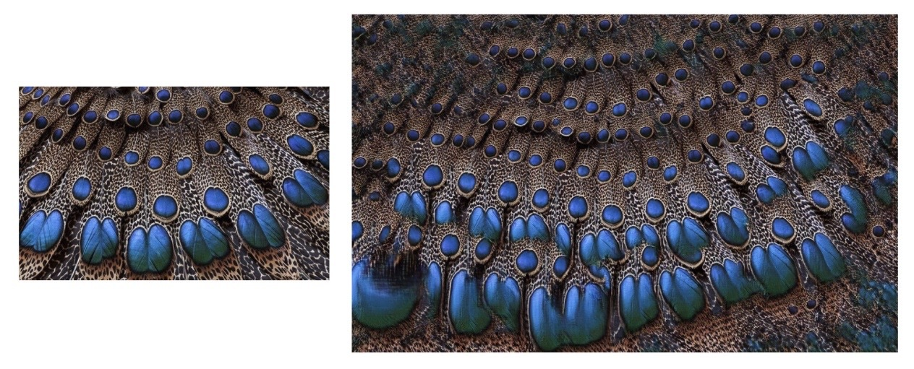
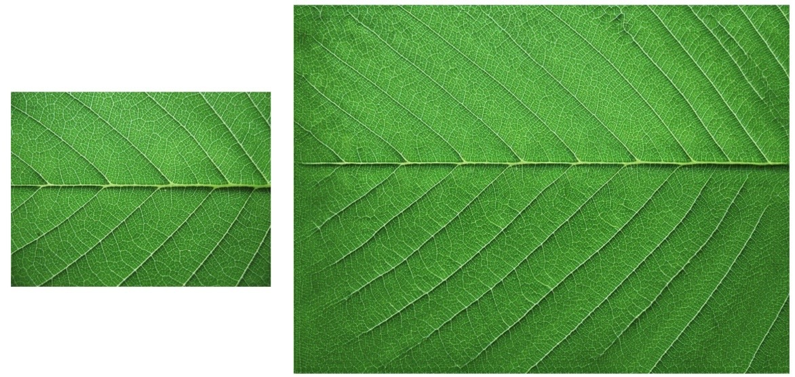
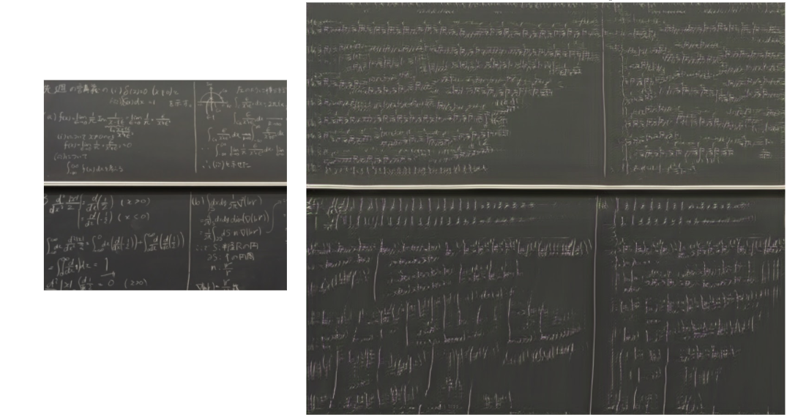

# Non-Stationary Texture Synthesis with Chainer

This is unofficial chainer implementation of [Non-Stationary Texture Synthesis by Adversarial Expansion.](https://arxiv.org/abs/1805.04487) (SIGGRAPH2018)

## usage

`test.ipynb` is for experiment on Google Colaboratory. Upload this directory to your Google Drive, place your image(s) to input in `dataset/` and specify its name in the cell, and execute all.

Then, a folder `{name of the input}_result/` will be created in `out/`. it holds the results from the entire image at every N(=1000) iterations, models of G&D, the last snapshot of the trainer, the image plotting the loss, and the log file.

## result with this implementation
左側が入力画像、右側が出力となる。

## reference

- [official implementation in Pytorch](https://github.com/jessemelpolio/non-stationary_texture_syn)
- [Chainer CycleGAN](https://github.com/Aixile/chainer-cyclegan)
- [DCGAN: Generate images with Deep Convolutional GAN](https://docs.chainer.org/en/stable/examples/dcgan.html)

---

## 元論文について

Images in this section are from the original paper.

### 概要

非周期的・大域的な構造を持つテクスチャを GAN を用いて空間的に二倍に拡張する手法の提案。入力は 1 枚の画像のみから訓練する。つまり、画像単位で学習を行う。

### 背景

研究領域としての Texture Synthesis では、これまでもしばしば「入力したテクスチャと同じ視覚的性質を持ったより大きな画像を出力したい」という問題設定のもとで様々な手法が提案されてきた。しかし、 Image Quilting, Texture Optimization などといった従来型のノンパラメトリックアルゴリズムベースの手法は、すべからくマルコフ確率場でモデリングできること（=周期性・規則性があること）を仮定しており、その仮定に反する非定常な（=大域的構造を持つ）テクスチャについては効果を発揮していなかった。この点についてはディープラーニングベースの手法も同様で、テクスチャの構造に周期性・規則性に関する仮定を入れないとうまくいかないものだった。

この研究は、既存研究でうまくいかない「非定常な」テクスチャというクラスがあることを指摘し、そして、このような非定常なテクスチャを生成する初の手法を提案したこと。そしてそれが、1枚の画像のみから訓練を行うという（2018年までとしては）珍しい手法によってなされていることが重要であると考えられる。

### 手法

入力のテクスチャ画像から, 以下の小領域を抽出することを考える。

- 入力画像から任意にサンプルした 2k × 2k の小領域 `T`
- `T` に含まれる k × k のある小領域 `S`（`T` の中心である必要はない）

これを用いて、以下のような GAN を訓練する。

- Generator: `S` を入力として、 2k × 2k の画像 `T'` を生成する
- Discriminator: `T` と `T'` をうまく識別する

損失関数は以下の線形結合とする。

- adversarial loss function (× 1)
- VGG19 による Style loss (× 1)
- L1 norm (× 100)

つまり、一枚の入力画像からサンプルできる小領域のみをデータセットとして用いて学習を行う。訓練後に入力画像全体を Generator に入れることで、それを 2 倍に拡大したような出力が得られる。ネットワークの構造は以下の通り。

### 結果

- それぞれの examplar に対して専用に訓練する必要はあるものの、一度訓練すれば極めて高速に動作する。
- もちろん、従来的な定常・周期的なテクスチャに対してもうまく動作している。
- generator の出力を再び入力に入れることで、倍々に拡大することができる。論文中では 64*64 の画像を五周回して 2048*2048 にしている例まであった。
- 訓練後、入力画像を適当にクロップして Generator に与えると、さまざまなバリエーションを作ることができる。
- また、あるテクスチャで訓練した Generator に、全く異なる画像を入力として与えると、学習時に使ったテクスチャが転写されるなどの効果も見られた。
- 入力のテクスチャの周縁を inject するモデル**ではない。入力画像の部分がそのまま保持されることはない。** 論文冒頭の以下の図中の、年輪のテクスチャの中心部分の構造はよく見ると変わっていることがわかる。
  